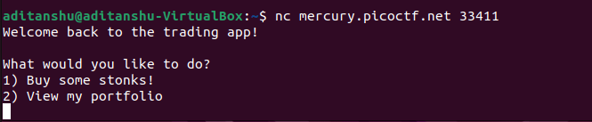
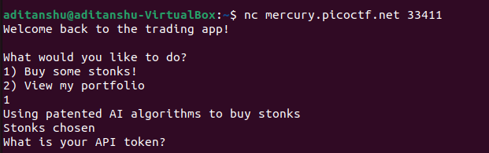
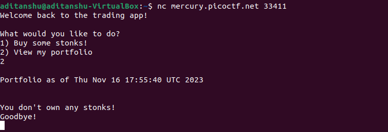
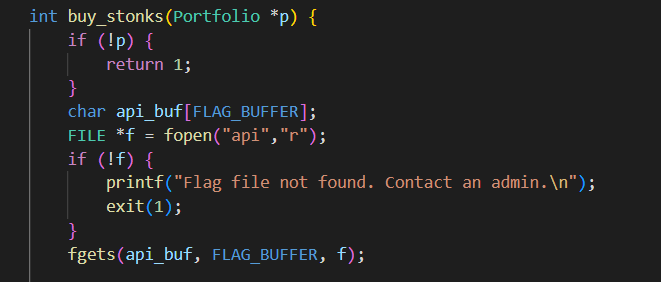
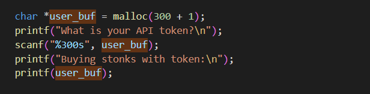
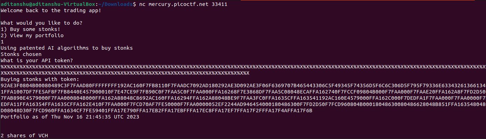
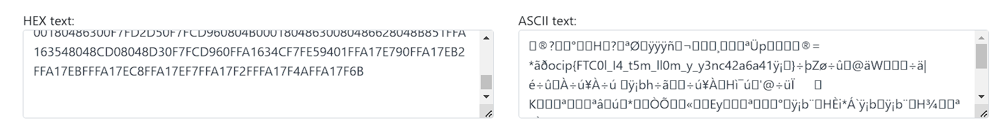

# Stonks
## Approach
1. Using netcat an linux gives us this.

2. Choosing first option ,it asks us about the api token which we apparently have to find as per the question.
 
3. choosing opt 2 it shows i own no stonks.

4. now looking at the c code of  the program we can see that it is trying to read from the file __api__ into __api-buf__

5. here we can see the format string missing in the **printf(user_buf)** which is very vulnerable for the stack security.

6. its vulnerable as if we input the format string as the input it will act as if the format string is calling the var_rg to give the value in the  stack. which will basically leak the info from stack.
7. we can try this by the hexadecimal format string "%x".

8. we can now convert the hex to text by any converter.

9. we can now see the flag but its reversed and also in the segments of 4 bits, this is beacuse each character is 8 bits and 8x4=32 bit which is the register length.
10.                ocip{FTC0l_I4_t5m_ll0m_y_y3nc42a6a41ÿ¡}
11.   we can segment it by:
    
               ocip
               {FTC
               0l_I
               4_t5
               m_ll
               0m_y
               _y3n
               c42a
               6a41
               ÿ¡}
12. then reverse every register.
    
               pico   
               CTF{    
               I_l0  
               5t_4 
               ll_m 
               y_m0   
               n3y_   
               a24c 
               14a6   
               }¡ÿ      
13. after the brackets the values are unreadable so ignore them.
14. The flag is:
    
                picoCTF{I_l05t_4ll_my_m0n3y_a24c14a6}
## Links

https://www.youtube.com/watch?v=FYfF2zKy52Y
https://www.youtube.com/watch?v=VXol2-SoUy8

